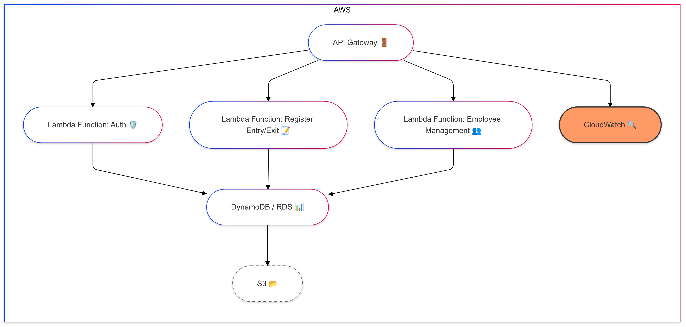

## 📋 Índice

- [Resumen del Proyecto](#-resumen-del-proyecto)
- [Demo](#-demo)
- [Arquitectura](#️-arquitectura)
- [Dependencias Principales](#️-dependencias-principales)
- [Configuración y Ejecución](#-configuración-y-ejecución)
- [Testing](#-testing)
- [Internacionalización](#-internacionalización)
- [Registro (Logging)](#-registro-logging)

## 📝 Resumen del Proyecto

**Sistema de Registro de Empleados** es una aplicación diseñada para ARMIRENE COLOMBIA S.A.S. que permite registrar el ingreso y la salida de empleados, así como administrar su información de manera eficiente. Actualmente, el proceso se realiza manualmente mediante hojas de cálculo, lo que dificulta la administración y el uso de esta información en otros procesos críticos.

### Funcionalidades Principales:

- 📋 Registro de ingreso y salida de empleados.
- ➕ Agregar nuevos empleados con validación de datos.
- ✏️ Editar información de empleados existentes.
- 🔍 Filtrar y buscar empleados.


## 🏗️ Arquitectura

El proyecto implementa una arquitectura limpia y organizada por capas, asegurando un mantenimiento y escalabilidad óptimos. La estructura es la siguiente:

# prueba-armirene
prueba técnica
# Proyecto de Gestión de Usuarios

Este proyecto es una API RESTful desarrollada con Spring Boot para la gestión de usuarios. Permite crear, leer, actualizar y eliminar información de usuarios en un sistema.

## Estructura del Proyecto
La estructura del proyecto se organiza en varios paquetes, cada uno con su propia funcionalidad:

- **com.arminere.demo**: Paquete principal de la aplicación.
- **com.arminere.demo.controller**: Controladores para manejar las solicitudes HTTP.
- **com.arminere.demo.dto**: Objetos de transferencia de datos.
- **com.arminere.demo.dtomapper**: Mapeo entre DTOs y entidades.
- **com.arminere.demo.exception**: Manejo de excepciones personalizadas.
- **com.arminere.demo.model**: Clases de modelo que representan la lógica de negocio.
- **com.arminere.demo.repository**: Interfaces para acceso a datos.
- **com.arminere.demo.service**: Servicios que contienen la lógica de negocio.
- **com.arminere.demo.service.imp**: Implementaciones de los servicios.
- **com.arminere.demo.util**: Clases utilitarias.

src/
├── main/
│   ├── java/
│   │   └── com/
│   │       └── arminere/
│   │           └── demo/
│   │               ├── controller/
│   │               ├── dto/
│   │               ├── model/
│   │               ├── repository/
│   │               ├── service/
│   │               └── exception/
│   └── resources/
│       └── application.properties
└── test/
    └── java/
        └── com/
            └── arminere/
                └── demo/

## Requisitos
- JDK 17 o superior
- Maven 3.6 o superior
- Spring Boot 3.x

## Instalación
1. Clona el repositorio:
   ```bash
   git clone https://github.com/omar-agudelo/prueba-armirene.git
   cd prueba-armirene
   ```

2. Construye el proyecto usando Maven:
   ```bash
   mvn clean install
   ```

3. Ejecuta la aplicación:
   ```bash
   mvn spring-boot:run
   ```
   
### Capas de la Arquitectura:

- **Controladores**: Manejan las solicitudes y respuestas HTTP.
- **Servicios**: Contienen la lógica de negocio.
- **Repositorios**: Interactúan con la base de datos para almacenar y recuperar información.
- **Modelos**: Definen las entidades de la aplicación.

## 🛠️  Dependencias Principales

```xml
<dependencies>
    <dependency>
        <groupId>org.springframework.boot</groupId>
        <artifactId>spring-boot-starter-web</artifactId>
    </dependency>
    <dependency>
        <groupId>org.springframework.boot</groupId>
        <artifactId>spring-boot-starter-data-jpa</artifactId>
    </dependency>
    <dependency>
        <groupId>com.h2database</groupId>
        <artifactId>h2</artifactId>
        <scope>runtime</scope>
    </dependency>
    <dependency>
        <groupId>org.springframework.boot</groupId>
        <artifactId>spring-boot-starter-test</artifactId>
        <scope>test</scope>
    </dependency>
</dependencies>
```

La aplicación se ejecutará en `http://localhost:8080`.

## Endpoints

### Crear un nuevo usuario

**POST** `/v1/user`

Ejemplo de solicitud:

```bash
curl --location 'http://localhost:8080/v1/user' --header 'Content-Type: application/json' --data-raw '{{
    "primerApellido": "ROJAS",
    "segundoApellido": "PEREZ",
    "primerNombre": "ANDRES",
    "otrosNombres": "CARLOS",
    "pais": "Colombia",
    "tipoIdentificacion": "Cédula de Ciudadanía",
    "numeroIdentificacion": "12345679",
    "correoElectronico": "juan.perez@armirene.com.co",  
    "fechaIngreso": "2024-10-29",  
    "area": "Talento Humano"
}}'
```

### Buscar usuarios

**GET** `/v1/user`

Ejemplo de solicitud:

```bash
curl --location 'http://localhost:8080/v1/user?primerNombre=ANDRES&otrosNombres=CARLOS%20ANTONIO%20RODRIGUEZ%20SOLANO&primerApellido=PEREZ&segundoApellido=ROJAS&tipoIdentificacion=C%C3%A9dula%20de%20Ciudadan%C3%ADa&numeroIdentificacion=12345678&paisEmpleo=Colombia&correoElectronico=juan.perez%40armirene.com.co&page=0&size=10'
```

### Actualizar un usuario existente

**PUT** `/v1/user/{id}`

Ejemplo de solicitud:

```bash
curl --location --request PUT 'http://localhost:8080/v1/user/1' --header 'Content-Type: application/json' --data-raw '{{
    "primerApellido": "PEREZ",
    "segundoApellido": "ROJAS",
    "primerNombre": "JULIO",
    "otrosNombres": "CARLOS ANTONIO RODRIGUEZ SOLANO",
    "pais": "Colombia",
    "tipoIdentificacion": "Cédula de Ciudadanía",
    "numeroIdentificacion": "12345678",
    "correoElectronico": "juan.perez@armirene.com.co",  
    "fechaIngreso": "2024-10-29",  
    "area": "Contabilidad",
    "fotoEmpleado": "data:image/png;base64,iVBORw0KGgoAAAANSUhEUgAAAAUA"
}}'
```
## Pruebas de Carga
Para realizar pruebas de carga en este proyecto, se han incluido tres archivos de configuración de JMeter en la raíz del repositorio. Estos archivos corresponden a distintas solicitudes y casos de uso de la API. Puedes importarlos a JMeter y ejecutarlos directamente para simular el tráfico y analizar el rendimiento de la aplicación.

### Pasos para Ejecutar las Pruebas de Carga

-**Abrir JMeter**: Asegúrate de tener JMeter instalado y ejecutándolo en tu máquina.

-**Importar Archivos de Prueba**:  En la raíz del repositorio de Git, encontrarás tres archivos con la extensión .jmx. Importa cada uno en JMeter desde File > Open.

-**Ejecutar las Pruebas**: Cada archivo simula una solicitud diferente de la API y está preconfigurado con los datos necesarios. Puedes modificar los parámetros de los hilos o el tiempo de espera para adaptarlos a tus necesidades.

## Arquitectura Propuesta



### Componentes de la Arquitectura
API Gateway (🚪): Actúa como el punto de entrada para todas las solicitudes a la API. Permite la gestión de rutas, autenticación y autorización, y escalabilidad automática.

### AWS Lambda Functions:

**Auth Function (🛡️)**: Se encarga de autenticar a los usuarios que acceden a la API, asegurando que solo los empleados autorizados puedan registrar su entrada y salida.

**Register Entry/Exit Function (📝)**: Permite registrar el ingreso y salida de los empleados. Esta función se invoca cuando un empleado interactúa con la API para registrar su tiempo.

**Employee Management Function (👥)**: Proporciona funcionalidades para gestionar la información de los empleados, como la creación, actualización y eliminación de registros.

**Base de Datos (📊)**:
**DynamoDB o RDS**: Almacena la información de los empleados y los registros de entradas y salidas. DynamoDB ofrece una solución NoSQL escalable, mientras que RDS proporciona una base de datos relacional tradicional.

**Almacenamiento en S3 (📂)**: Utilizado para almacenar archivos y datos estáticos relacionados con los empleados, como documentos de identificación o certificados.

**Monitoreo con CloudWatch (🔍)**: Permite la supervisión de la API, registrando métricas y eventos que ayudan a identificar problemas de rendimiento y optimizar la infraestructura.

## Justificación De La Arquitectura Propuesta

### Beneficios de la Solución

**Automatización**: Al eliminar el proceso manual de registro en hojas de cálculo, se reduce la posibilidad de errores humanos y se optimizan los tiempos de registro.

**Integración de Datos**: La API facilita la integración con otros sistemas y procesos en la organización, permitiendo un flujo de información más eficiente.

**Escalabilidad**: Con el uso de AWS Lambda y API Gateway, la arquitectura puede escalar automáticamente según la demanda, garantizando un rendimiento óptimo incluso durante picos de actividad.

**Seguridad**: La implementación de funciones de autenticación asegura que solo los empleados autorizados tengan acceso a la API y a la información sensible.

**Monitoreo Proactivo**: Con CloudWatch, se pueden identificar y resolver problemas de rendimiento antes de que afecten a los usuarios, garantizando la disponibilidad del sistema.

## Contribuciones

Las contribuciones son bienvenidas. Por favor, envía un pull request o abre un issue para discutir cambios.

## Licencia

Este proyecto está bajo la Licencia MIT. Consulta el archivo `LICENSE` para más detalles.
